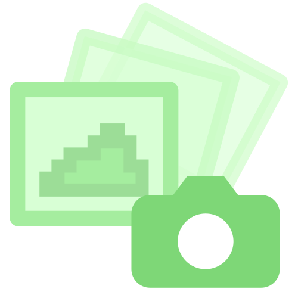
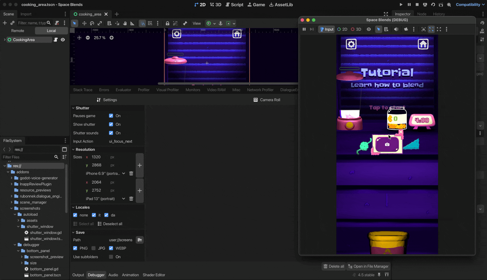

<p align="center">

</p>

# Screenshots
Godot addon that lets you rapidly take screenshots. Supports taking bursts in multiple resolutions, locales, and formats.

<p align="center">

</p>

## Installation
- Download the addon from [AssetLib](https://godotengine.org/asset-library/asset/4405) within the Godot Editor
- Enable the addon in the Project Settings

## Usage
1. Play a scene
2. (Optional) Adjust settings in the Debugger panel
3. Press the shutter button
4. View your screenshots in the Camera Roll or click on the link in the Output panel

## Configuration
Configure the addon from its Debugger panel. Settings are stored at `settings.cfg`.
### Shutter
- **Show shutter**: Toggle shutter visibility
- **Only run in Editor**: If the game is running outside the editor (`OS.has_feature("editor")` is `false`), hide the shutter and disable input processing
- **Pauses game**: Pause execution while taking screenshots. Useful for ensuring consistency across burst captures.

- **Shutter sounds**: Whether to play shutter sound effect
- **Input Action**: Set an Input Action to trigger a screenshot

### Resolution
- Specify one or more target sizes. The addon calls `DisplayServer.window_set_size()` for each size before capturing.

### Locales
- Select locales to load before taking screenshots.

### Save
- **Path**: Screenshot save location (default: `user://screenshots`)
- **Formats**: PNG, JPG, WEBP
- **Use subfolders**: Organize bursts into folders with this structure `projectname_timestamp/locale/resolution`

## API
Accessible through the `Screenshots` singleton.
### Methods

```gdscript
take_burst()
```
Takes one or more screenshots (a burst) using settings specified in the Debugger panel.

### Signals
```gdscript
burst_starting
```
Fires before capture. Use this to hide debug UI elements.

```gdscript
image_captured(image: Image)
```
Fires after each individual capture.

```gdscript
burst_ended
```
Fires after the burst is completed. Use it to unhide debug UI elements.

#### Example
```gdscript
func _ready() -> void:
    Screenshots.burst_starting.connect(_hide_debug_ui)
    Screenshots.burst_ended.connect(_show_debug_ui)
```

## Version Compatibility
Tested on Godot 4.5 (Linux and macOS)

## Support
For bugs and feature requests, please open an issue. Additional questions? Email [hello@pumpkintree.games](mailto:hello@pumpkintree.games)

## Credits
- Developed by [Davide Di Staso](http://www.pumpkintree.games)
- Uses [Directory Watcher](https://github.com/KoBeWi/Godot-Directory-Watcher) by Tomek
- Screenshots addon icon based on modified Godot Editor icons
- Shutter icon by [Bootstrap](https://github.com/twbs/icons)
- Shutter sound effect by [ALEXIS_GAMING_CAM](https://pixabay.com/users/alexis_gaming_cam-50011695/) from [Pixabay](https://pixabay.com/)
- [Editor Theme Explorer](https://github.com/YuriSizov/godot-editor-theme-explorer) by Yuri Sizov and [Godot Plugin Reloader](https://github.com/kenyoni-software/godot-addons) by Iceflower have been used during development